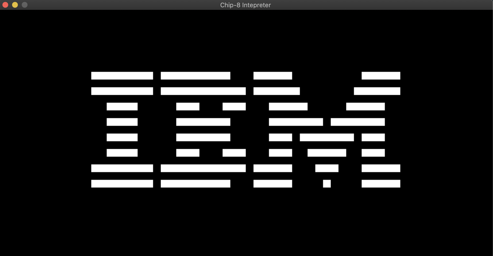

# Chip8 Intepreter
Chip8 Intepreter written in C99\
Used the following documentation: http://mattmik.com/files/chip8/mastering/chip8.html\
\
## What is a Chip-8
Taken from: http://mattmik.com/files/chip8/mastering/chip8.html\
"CHIP-8 is an interpreted minimalist programming language that was designed by Joseph Weisbecker in the 1970s for use on the RCA COSMAC VIP computer. Due to its hexadecimal format, it was best suited to machines with a scarcity of memory, as minimal text processing had to be performed by the interpreter before a program could be executed. This property inevitably led to its implementation on a variety of hobbyist computers aside from the VIP, such as the COSMAC ELF, Telmac 1800, and ETI 660."

## Usage
```c
./chip8.out <ROM>
```

## Current Progress
